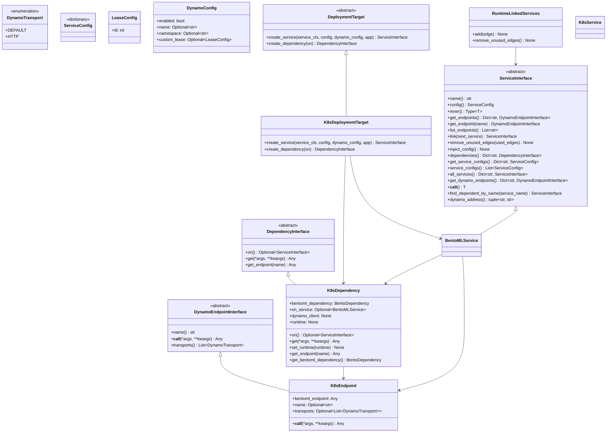

# Decoupling Dynamo Architecture & Supporting Multiple Target Runner Environments

## Overview

The goal is to decouple the core Dynamo SDK from any specific serving or orchestration backend and introduce a flexible, pluggable architecture that allows users to select from multiple runner environments (e.g., BentoML, Circus, Ray, Slurm, Docker Compose, etc.) for service deployment and execution.

This will be achieved by:
- Defining a clear, extensible interface for deployment targets and runners.
- Refactoring the SDK to depend only on these interfaces, not on any concrete implementation.
- Providing adapters for each supported environment.
- Allowing users to select or register their desired runner at runtime.

## Key Concepts

- **Dynamo Interfaces**: Abstract [interface](../src/dynamo/sdk/core/service/interface.py) service definition from its execution environment.

- **DeploymentTarget**: Concrete implementation of DeploymentTarget for a specific environment.
    For example: [Kubernetes](../src/dynamo/sdk/core/targets/kubernetes.py), [Local](../src/dynamo/sdk/core/targets/local.py), Ray,  Slurm etc)

- **Target Injection**: Used to inject the appropriate runner/target at runtime during dynamo lifecycle management. [set_deployment_target](../src/dynamo/sdk/cli/utils.py)

- **Deployment Artifacts**: A generic intermediate representation of artifacts would enable portability of user code.

## Link Syntax and Runtime Graph Management
The link syntax in Dynamo architecture defines service dependencies, forming a directed graph.

[RuntimeLinkedServices](../src/dynamo/sdk/core/service/interface.py) manages these links, tracking active and unused edges to optimize execution. At runtime, only a sub-graph defined by explicitly linked services is executed, optimizing resource usage by activating only necessary services. This approach allows for flexible deployments of llm architectures.

